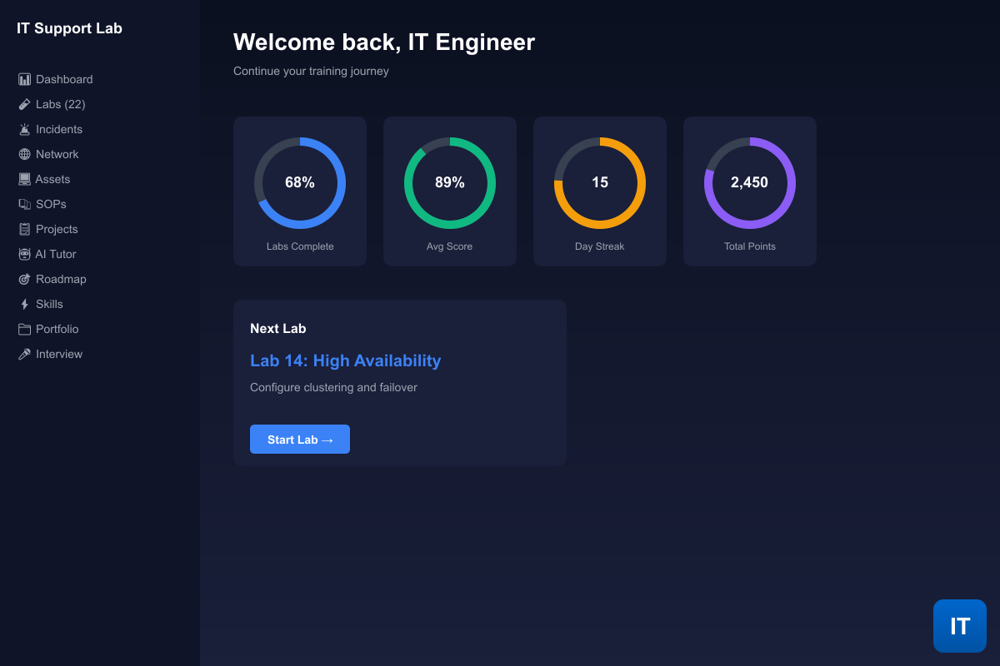
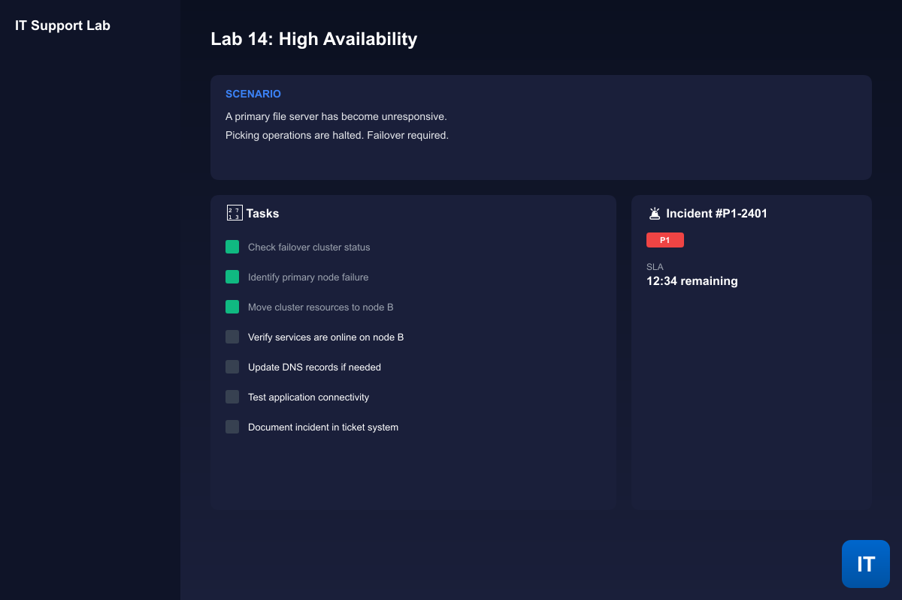
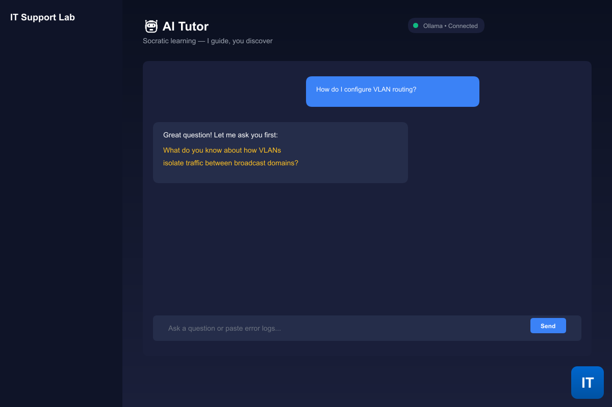
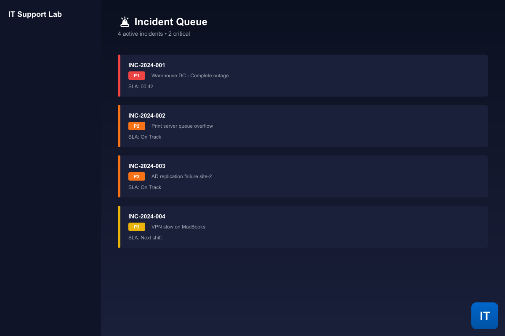
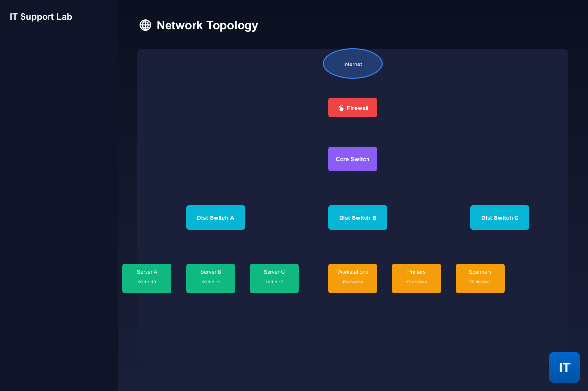
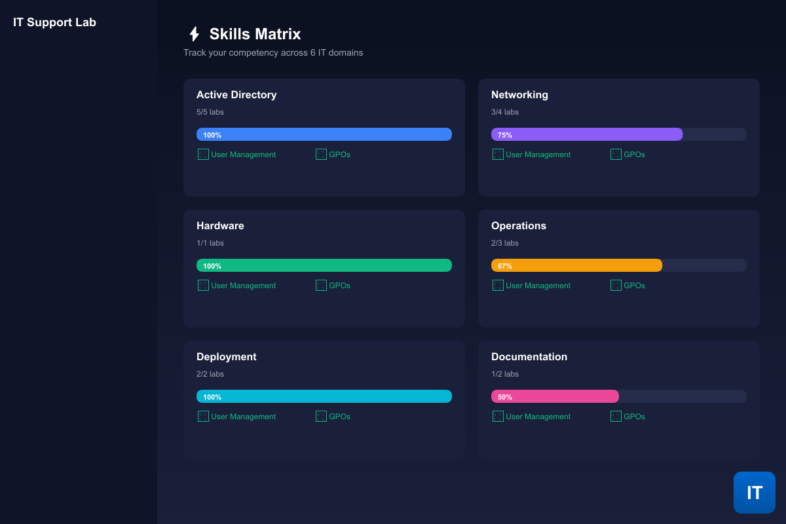

# Amazon IT Support Engineer I — Lab Platform

<div align="center">



**A hands-on interactive training platform that simulates the day-to-day work of an Amazon IT Support Engineer I**

[](https://nextjs.org/)
[](https://www.typescriptlang.org/)
[](https://tailwindcss.com/)
[](https://www.electronjs.org/)

**[Download for Windows](#download--installation)** · **[Documentation](#documentation)** · **[AI Tutor](#ai-tutor)**

</div>

---

## 📋 Table of Contents

- [Overview](#overview)
- [Download & Installation](#download--installation)
- [Features](#-features)
- [Screenshots](#-screenshots)
- [22 Hands-On Labs](#-22-hands-on-labs)
- [AI Tutor](#ai-tutor)
- [Architecture](#architecture)
- [Getting Started](#getting-started)
- [Development](#development)
- [Building](#building)

---

## Overview

This platform provides a realistic simulation of an Amazon IT Support Engineer I role, featuring:

- ✅ **22 Structured Labs** — From Windows Server basics to enterprise networking
- ✅ **AI-Powered Tutor** — Socratic learning with local Ollama or cloud AI
- ✅ **Incident Simulation** — Real-world ticket scenarios with time pressure
- ✅ **Progress Tracking** — Rubric-based scoring with detailed feedback
- ✅ **Portfolio Generation** — Evidence of completed work
- ✅ **Interview Prep** — STAR-style questions and flashcard practice
- ✅ **Desktop App** — Native Windows experience via Electron

---

## Download & Installation

### Option 1: Windows Installer (Recommended)

Download the latest release from GitHub:

```bash
# Visit the Releases page and download:
Amazon IT Support Lab-Setup-x.x.x.exe
```

Run the installer and follow the prompts:

1. Click **Next** on the welcome screen
2. Choose **Install location** (default: `C:\Program Files\Amazon IT Support Lab`)
3. Click **Install**
4. Click **Finish** to launch the app

The app will create shortcuts on your **Desktop** and in the **Start Menu**.

### Option 2: Portable Version

Download the portable ZIP and extract to any folder. Run `Amazon IT Support Lab.exe` directly.

### System Requirements

| Requirement | Minimum | Recommended |
|------------|---------|-------------|
| OS | Windows 10 | Windows 11 |
| RAM | 4 GB | 8 GB |
| Storage | 500 MB | 1 GB |
| Display | 1280×720 | 1920×1080 |

---

## 🎯 Features

### Dashboard

- Progress rings showing completion percentage
- Quick stats (completed labs, current streak, total points)
- Next recommended lab based on your progress
- Recent activity timeline

### Lab Experience

- **7-Phase Flow**: Intro → Tasks → Incident → Evidence → Hints → Scoring → Review
- Interactive task checklists
- Hidden root cause discovery
- 5-level hint escalation system
- Rubric-based scoring (8 categories, 100 points)

### AI Tutor

- Socratic method — guides with questions, never reveals answers
- Connects to local **Ollama** (localhost:11434) automatically
- Falls back to **OpenRouter** if API key configured
- Graceful offline mode

### Incident Queue

- Real-time ticket simulation
- Priority indicators (P1-P4)
- SLA countdown timers
- Resolution workflow

### Network Topology

- Interactive SVG warehouse topology
- Clickable nodes for details
- Visual network map

---

## 📸 Screenshots

| Dashboard | Lab Interface | AI Tutor |
|:---------:|:-------------:|:--------:|
|  |  |  |

| Incident Queue | Network Map | Skills Matrix |
|:--------------:|:-----------:|:-------------:|
|  |  |  |

---

## 📚 22 Hands-On Labs

### Foundations (1-5)
| Lab | Title | Topics |
|-----|-------|--------|
| 01 | Operations IT Baseline | Ticketing, monitoring, escalation |
| 02 | Active Directory | Users, groups, OUs, GPOs |
| 03 | DNS | Records, zones, resolution |
| 04 | DHCP | Scopes, reservations, IPAM |
| 05 | AD Access Management | Permissions, NTFS, share access |

### File, Print & Endpoint (6-9)
| Lab | Title | Topics |
|-----|-------|--------|
| 06 | DFS | Namespaces, replication |
| 07 | Print Services | Drivers, pooling, permissions |
| 08 | SCCM/MECM | Deployment, software distribution |
| 09 | PC Repair | Hardware diagnostics, imaging |

### Multi-OS & Networking (10-13)
| Lab | Title | Topics |
|-----|-------|--------|
| 10 | Multi-OS Support | Linux, macOS, cross-platform |
| 11 | Cisco VLANs | Trunking, VTP, inter-VLAN routing |
| 12 | TCP/IP & OSI | Packet analysis, troubleshooting |
| 13 | Cabling & Standards | T568A/B, fiber, testing |

### Operations (14-15)
| Lab | Title | Topics |
|-----|-------|--------|
| 14 | High Availability | Clustering, failover, load balancing |
| 15 | RCA & Continuous Improvement | 5 Whys, fishbone, corrective actions |

### Collaboration (16-18)
| Lab | Title | Topics |
|-----|-------|--------|
| 16 | Video Conferencing | Teams, Zoom, room systems |
| 17 | Asset Lifecycle | Procurement, tracking, disposal |
| 18 | Data Center Closet | UPS, PDU, rack management |

### Projects & Documentation (19-20)
| Lab | Title | Topics |
|-----|-------|--------|
| 19 | Site Expansion Project | Planning, execution,验收 |
| 20 | SOP Knowledge Base | Runbooks, change control |

### Capstone (21-22)
| Lab | Title | Topics |
|-----|-------|--------|
| 21 | Shift Simulation | Multiple concurrent incidents |
| 22 | Warehouse IT Capstone | Full environment simulation |

---

## AI Tutor

The AI Tutor uses a **Socratic teaching method** — it guides you with questions rather than giving direct answers.

### Setup

**Option 1: Local Ollama (Recommended)**
```bash
# Install Ollama
# https://ollama.ai

# Pull a model
ollama pull llama3.2

# Ollama will automatically be detected at localhost:11434
```

**Option 2: OpenRouter (Cloud)**
```bash
# Set environment variable
export NEXT_PUBLIC_OPENROUTER_API_KEY=your-api-key
```

### How It Works

1. Ask questions when stuck on a lab
2. Receive guiding questions, not answers
3. Discover solutions through exploration
4. Build real problem-solving skills

---

## Architecture

```
┌─────────────────────────────────────────────────────────────┐
│                    Electron Shell                            │
│  ┌─────────────────────────────────────────────────────┐   │
│  │              Next.js Application                      │   │
│  │  ┌──────────┐  ┌──────────┐  ┌──────────────────┐ │   │
│  │  │ Dashboard │  │  Labs    │  │   AI Tutor       │ │   │
│  │  └──────────┘  └──────────┘  └──────────────────┘ │   │
│  │  ┌──────────┐  ┌──────────┐  ┌──────────────────┐ │   │
│  │  │ Incidents │  │ Network  │  │   Portfolio      │ │   │
│  │  └──────────┘  └──────────┘  └──────────────────┘ │   │
│  └─────────────────────────────────────────────────────┘   │
│  ┌─────────────────────────────────────────────────────┐   │
│  │              LocalStorage Persistence                 │   │
│  └─────────────────────────────────────────────────────┘   │
└─────────────────────────────────────────────────────────────┘
```

### Tech Stack

| Layer | Technology |
|-------|------------|
| Framework | Next.js 16.3 (App Router) |
| Language | TypeScript 5 |
| Styling | Tailwind CSS v4 |
| Desktop | Electron 44 |
| Packaging | electron-builder |
| Storage | localStorage |
| AI | Ollama / OpenRouter |

---

## Getting Started

### Run as Web App

```bash
# Clone the repository
git clone https://github.com/pitchiluxe/amazon-it-support-lab-platform.git
cd amazon-it-support-lab-platform

# Install dependencies
npm install

# Start development server
npm run dev

# Open http://localhost:3000
```

### Run as Desktop App

```bash
# Development mode
npm run electron:dev

# Or build and run
npm run dist
```

---

## Development

### Project Structure

```
src/
├── app/                    # Next.js App Router pages
│   ├── (marketing)/       # Landing pages
│   ├── (platform)/        # App pages
│   ├── labs/[id]/         # Dynamic lab pages
│   └── ...                # Other routes
├── components/
│   ├── ui/                # Base UI (Button, Card, Modal...)
│   ├── layout/            # Sidebar, TopBar, PageHeader
│   ├── dashboard/        # Dashboard components
│   ├── labs/              # Lab engine (7 phases)
│   ├── incidents/        # Incident panel
│   └── tutor/            # AI chat interface
├── lib/
│   ├── storage.ts         # localStorage CRUD
│   ├── labEngine.ts       # Lab state machine
│   ├── incidentEngine.ts  # Incident resolution
│   ├── scoring.ts        # Rubric-based scoring
│   ├── aiTutor.ts        # AI integration
│   └── labData.ts        # Lab registry
├── data/labs/            # 22 lab definitions
└── types/                # TypeScript interfaces
```

### Adding a New Lab

```typescript
// src/data/labs/lab23.ts
import type { Lab } from "@/types";

export const lab23: Lab = {
  id: "lab23",
  number: 23,
  title: "Your New Lab",
  category: "networking",
  difficulty: "intermediate",
  estimatedMinutes: 45,
  objectives: [...],
  prerequisites: [...],
  scenario: "...",
  environment: [...],
  tasks: [...],
  hints: [...],         // 5 levels
  validation: [...],    // 3-5 tests
  rubric: [...],        // 8 categories summing to 100
  requiredEvidence: [...],
  deliverables: [...],
  interviewQuestion: "...",
};
```

Then register in `src/lib/labData.ts`.

---

## Building

### Prerequisites

```bash
npm install
```

### Build Commands

```bash
# Development build
npm run build

# Package for Windows
npm run dist:win

# Package for all platforms
npm run dist
```

### Output

The installer will be created in `dist/`:
- `Amazon IT Support Lab-Setup-1.0.0.exe` — Windows NSIS installer

---

## License

Practice environment only. Never use these techniques on production systems without authorization.

---

<div align="center">

**Built with ❤️ for IT professionals preparing for Amazon**

</div>
